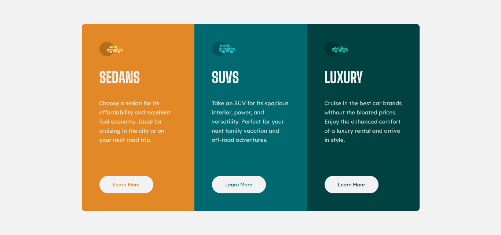

# Frontend Mentor - 3-column preview card component solution

This is a solution to the [3-column preview card component challenge on Frontend Mentor](https://www.frontendmentor.io/challenges/3column-preview-card-component-pH92eAR2-). Frontend Mentor challenges help you improve your coding skills by building realistic projects. 

## Table of contents

- [Overview](#overview)
  - [The challenge](#the-challenge)
  - [Screenshot](#screenshot)
  - [Links](#links)
- [My process](#my-process)
  - [Built with](#built-with)
- [Author](#author)

## Overview

### The challenge

Users should be able to:

- View the optimal layout depending on their device's screen size
- See hover states for interactive elements

### Screenshot

[**3-Column-Preview-Card** ](https://3kori.github.io/frontend-mentor-projects/3-column-preview-card-component-main/index.html)

### Links

- Solution URL: [Solution](https://www.frontendmentor.io/solutions/3-column-preview-card-component-main-GnegSNxRLK)
- Live Site URL: [Live Site](https://3kori.github.io/frontend-mentor-projects/3-column-preview-card-component-main/index.html)

## My process

### Built with

- Semantic HTML5 markup
- CSS custom properties
- Flexbox

## Author

- Website - [Add your name here](https://www.your-site.com)
- Frontend Mentor - [@3kori](https://www.frontendmentor.io/profile/3kori)