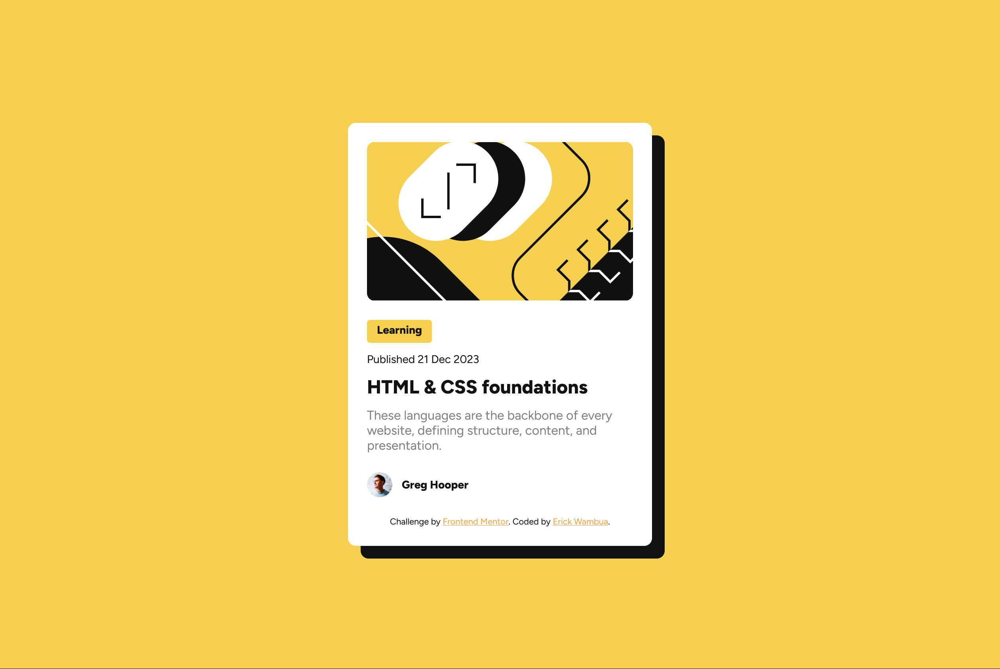

# Frontend Mentor - Blog preview card solution

This is a solution to the [Blog preview card challenge on Frontend Mentor](https://www.frontendmentor.io/challenges/blog-preview-card-ckPaj01IcS). Frontend Mentor challenges help you improve your coding skills by building realistic projects. 

## Table of contents

- [Overview](#overview)
  - [The challenge](#the-challenge)
  - [Screenshot](#screenshot)
  - [Links](#links)
- [My process](#my-process)
  - [Built with](#built-with)
  - [What I learned](#what-i-learned)
  - [Useful resources](#useful-resources)
- [Author](#author)

**Note: Delete this note and update the table of contents based on what sections you keep.**

## Overview

### The challenge

Users should be able to:

- See hover and focus states for all interactive elements on the page

### Screenshot



### Links

- Solution URL: [Solution](https://your-solution-url.com)
- Live Site URL: [Live site](https://frontend-mentor-projects-liart.vercel.app/blog-preview-card-main/index.html)

## My process

### Built with

- Semantic HTML5 markup
- CSS custom properties
- Flexbox
- Mobile-first workflow

### What I learned

In this project i learn how to use flexbox more efficiently, making the page responsive and adding a box shadow.

Below are code snippets of what I learned.
```css
@media(max-width: 375px){
    .container {
        max-width: 327px;
    }

    .learn-box {
        width: 73px;
        height: 26px;
    }
}

@media(max-width: 320px){
    .container {
        max-width: 272px;
    }

    .learn-box {
        width: 82px;
        height: 29px;
    }
}
```

### Useful resources

- [Learn flexbox the easy way(Kevin Powell)](https://www.youtube.com/watch?v=u044iM9xsWU) - This helped me understand the concept of flexbox. I really liked how the idea  was executed in that resource.
- [Box shadows](https://www.w3schools.com/css/css3_shadows_box.asp) - This is an amazing resource which helped me finally understand box shadows. I'd recommend it to anyone still learning this concept.
- [Media Queries](https://www.w3schools.com/css/css_rwd_mediaqueries.asp) - This is an amazing resource which helped me finally understand how media queries work. I'd recommend it to anyone still learning this concept.

## Author

- Frontend Mentor - [@yourusername](https://www.frontendmentor.io/profile/3kori)
